# Social Media Crawler — Instagram Downloader

A containerized backend service built with Azure Durable Functions for downloading public Instagram posts and reels using the SociaVault API.

The service accepts a profile identifier, starts crawling asynchronously, stores normalized results in SQLite, and exposes endpoints for artifact creation, retrieval, health monitoring, and blob serving for downloaded media.

---

## Features

- Asynchronous crawl execution using Azure Durable Functions
- Support for publicly available Instagram posts and reels
- Integration with the free SociaVault Instagram API
- SQLite-based persistence for artifacts, contents, and blob metadata
- Pagination support for posts and reels
- Duplicate in-progress request detection
- Local blob serving for downloaded media
- Anonymous local routes for simpler evaluation and local testing

---

## Implemented Endpoints

- `POST /api/artifacts`
  - Starts a new crawl using `case_id`, `identifier`, and `description`
  - Supports pagination requests using `case_id`, `artifact_id`, and `content_type`
  - Returns an `artifact_id` immediately
  - Reuses the same `artifact_id` if the same request is already in progress
- `GET /api/artifacts`
  - Returns all stored artifacts
- `GET /api/artifacts/{id}`
  - Returns a specific artifact with metadata and contents
- `GET /api/health`
  - Returns `{"status": "ok"}`
- `GET /api/blob/{blob_id}`
  - Serves downloaded media files from local storage

---

## Local Setup

### Requirements

- [Python 3.10 - 3.13](https://www.python.org/downloads/)
- [Docker / Docker Desktop](https://www.docker.com/products/docker-desktop/)
- [Azure Functions Core Tools](https://learn.microsoft.com/en-us/azure/azure-functions/functions-run-local)
- [SociaVault](https://sociavault.com/) free API key

### Option 1: Run with Docker Compose

This option starts both the application and Azurite in containers. The application is exposed on port `8080`.

Create a `.env` file:

```env
SOCIAVAULT_API_KEY=your_real_api_key_here
```

Start the application:

```shell
docker compose up --build
```

Verify that both services are running:

```shell
docker compose ps
```

The screenshot below shows both the application container and Azurite running successfully.

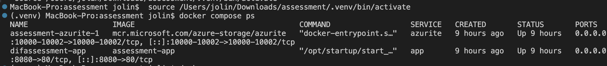

On Apple Silicon, the Compose file uses `platform: linux/amd64` for compatibility.

### Option 2: Run with Azure Functions Core Tools

The API screenshots and example responses below were captured using this local development mode on port `7071`.

Azure Durable Functions requires Azure Storage for orchestration state. For local development, Azurite is used as the storage emulator.

Create and activate a virtual environment:

```shell
python -m venv .venv
source .venv/bin/activate
```

Install dependencies:

```shell
pip install -r requirements.txt
```

Create `local.settings.json`:

```json
{
  "IsEncrypted": false,
  "Values": {
    "FUNCTIONS_WORKER_RUNTIME": "python",
    "AzureWebJobsFeatureFlags": "EnableWorkerIndexing",
    "AzureWebJobsStorage": "UseDevelopmentStorage=true",
    "SOCIAVAULT_API_KEY": "<your_api_key>"
  }
}
```

Start Azurite:

```shell
docker run -d -p 10000:10000 -p 10001:10001 -p 10002:10002 mcr.microsoft.com/azure-storage/azurite
```

Start the Functions app:

```shell
func start
```

---

## API Examples

### Health Check

```shell
curl -s http://localhost:7071/api/health | jq
```

**Response**

```json
{
  "status": "ok"
}
```

The screenshot below shows the health endpoint returning a successful JSON response.

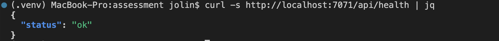

### Start New Download

```shell
curl -s -X POST http://localhost:7071/api/artifacts \
  -H "Content-Type: application/json" \
  -d '{"case_id":"123","identifier":"mothershipsg","description":"Instagram Profile of Mothership"}' | jq
```

**Response**

```json
{
  "artifact_id": "XXX"
}
```

The screenshot below shows a new crawl request returning an `artifact_id` immediately.

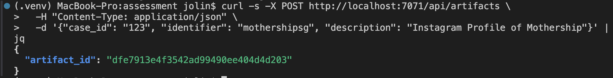

### Poll Artifact Status

```shell
curl -s http://localhost:7071/api/artifacts/<artifact_id> | jq
```

**Response**

```json
{
  "status": "processing",
  "has_more_data": [
    { "content_type": "post", "has_more_data": false },
    { "content_type": "reel", "has_more_data": false }
  ],
  "metadata": {
    "platform": "instagram",
    "identifier": "mothershipsg",
    "description": "Instagram Profile of Mothership"
  }
}
```

The screenshot below shows the artifact while it is still being processed.

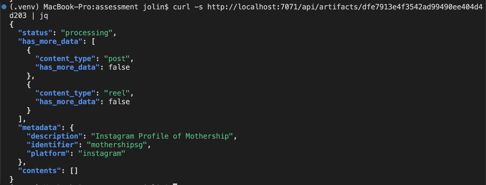

### Completed Artifact Response

```shell
curl -s http://localhost:7071/api/artifacts/<artifact_id> | jq '{status, metadata: {identifier: .metadata.identifier}, contents: [.contents[0] | {content_type, media_content: [.media_content[0] | {url}]}]}'
```

**Response**

```json
{
  "status": "success",
  "metadata": {
    "identifier": "mothershipsg"
  },
  "contents": [
    {
      "content_type": "post",
      "media_content": [
        {
          "url": "/api/blob/<blob_id>"
        }
      ]
    }
  ]
}
```

The screenshot below shows a successful completed artifact response with blob-backed media URLs.

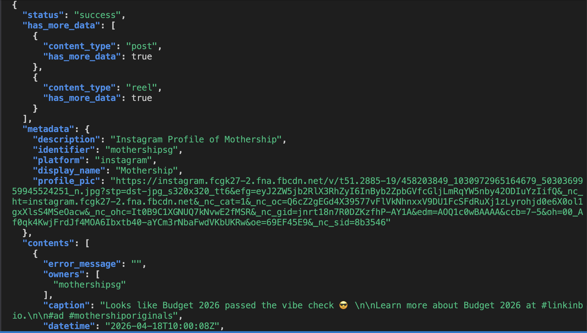

### Pagination

Pagination allows the existing artifact to be extended with additional results instead of creating a new artifact.

Before requesting another page, the artifact can be queried to check how many content items have already been stored.

```shell
curl -s http://localhost:7071/api/artifacts/<artifact_id> | jq '{status, content_count: (.contents | length)}'
```

**Example result before pagination**

```json
{
  "status": "success",
  "content_count": 24
}
```

A pagination request can then be sent using the same `artifact_id` together with the desired `content_type` such as `post` or `reel`.

```shell
curl -s -X POST http://localhost:7071/api/artifacts \
  -H "Content-Type: application/json" \
  -d '{"case_id":"123","artifact_id":"<artifact_id>","content_type":"post"}' | jq
```

**Response**

```json
{
  "artifact_id": "XXX"
}
```

The screenshot below shows the pagination request being accepted for the existing artifact.

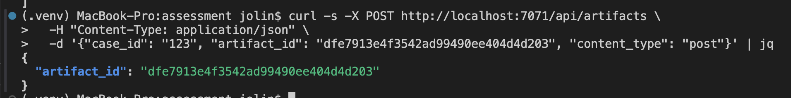

After pagination completes, the same artifact can be queried again. In this example, the content count increases from `24` to `36`, showing that additional results were appended to the existing artifact rather than creating a new one.

```shell
curl -s http://localhost:7071/api/artifacts/<artifact_id> | jq '{status, content_count: (.contents | length)}'
```

**Example result after pagination**

```json
{
  "status": "success",
  "content_count": 36
}
```

The screenshot below shows the updated content count after pagination.

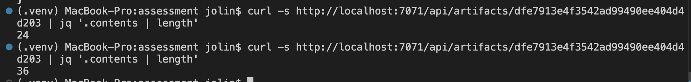

### Blob Response

Blob URLs returned in artifact contents can be downloaded directly through the blob endpoint.

```shell
curl -s http://localhost:7071/api/blob/<blob_id> --output test.jpg
```

**Response**

The requested file is returned with the correct `Content-Type`, such as `image/jpeg` or `video/mp4`.

The screenshot below shows the blob-serving endpoint being used successfully.

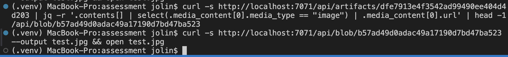

---

## Data Storage

SQLite is used as the persistence layer with three tables:

- `artifacts` — artifact metadata, processing status, profile details, and pagination cursors
- `contents` — normalized Instagram post and reel data
- `blobs` — downloaded media file mappings and MIME type metadata

This allows the application to preserve crawl results, support artifact retrieval after processing, and reuse pagination state for subsequent requests.

---

## Design Considerations

### Extensibility for Future Platform Support

The integration with the upstream API is isolated inside `external_api.py`, while orchestration, persistence, and HTTP handling are kept in separate modules. Although the current implementation targets Instagram only, this separation makes it easier to extend the project in the future by introducing additional platform-specific normalization functions and request handlers without changing the overall application flow.

### Media Normalization

SociaVault responses can vary across image posts, video posts, carousel posts, and reels. The normalization layer converts these different response shapes into a consistent internal format so that downstream storage and API responses remain predictable. For video content, the extraction logic handles multiple possible response structures and falls back across different fields when needed, improving robustness against inconsistent upstream payloads.

### Error Handling and Resilience

The implementation is designed to fail gracefully where possible. Failed crawl jobs are logged and marked with a `"failed"` artifact status through the orchestration flow. Reel fetch failures are logged as warnings and do not prevent successful post data from being saved. Blob download failures are also logged and skipped so that the artifact can still be returned even if some media files could not be downloaded. In addition, duplicate in-progress requests are prevented by returning the existing `artifact_id` for the same `case_id` and `identifier`.

### Pydantic Models

Response serialization uses Pydantic models in `models/artifact.py` to validate and structure API responses. Optional fields such as `url`, `thumbnail_url`, `display_name`, and `profile_pic` are omitted when absent, which keeps responses cleaner and more consistent with the expected schema.

---

## Testing

Run the test suite with:

```shell
pytest tests/ -v
```

### Testing approach and justification

The test coverage focuses on the parts of the system that contain the most important application logic and can be validated reliably without depending on a live SociaVault request or full Azure infrastructure.

#### `tests/test_external_api.py`

These tests verify the normalization layer because the upstream API can return different structures for image posts, video posts, carousel posts, and reels. The tests confirm that media URLs are extracted correctly, invalid reels are filtered out, and pagination fields are parsed as expected.

#### `tests/test_db.py`

These tests verify duplicate-request handling and persistence-related behavior. The tests confirm that an existing in-progress artifact is reused and that a new crawl can start when no matching in-progress artifact exists.

#### `tests/test_function_app.py`

These tests verify HTTP-layer behavior such as request validation, endpoint responses, and overall API handling.

The screenshot below shows the test suite passing locally.

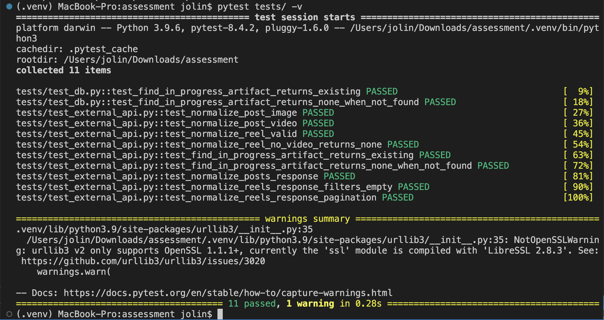

---

## Additional Validation Screenshots

The following screenshots provide extra evidence for behavior already described above.

### Duplicate Request Reuse (Idempotency)

If the same download request is submitted again while the artifact is still in progress, the API returns the existing `artifact_id` instead of creating a duplicate job.

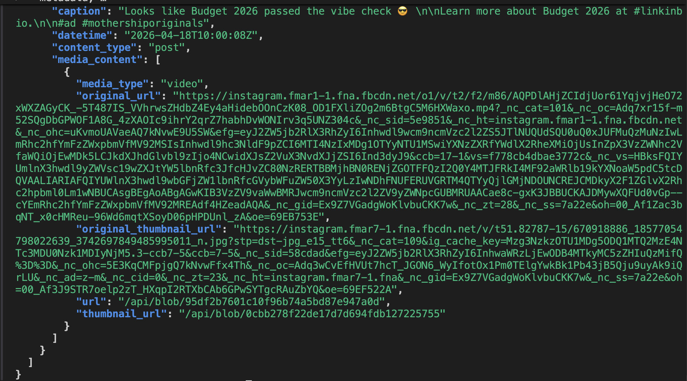

### Opened Downloaded Image

After downloading media through the blob endpoint, the returned image can be opened locally.


### Video Blob Download Response

The blob endpoint also supports video media retrieval.

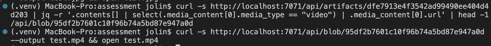

### Opened Downloaded Video Preview

After downloading video content through the blob endpoint, the returned media can be opened locally.


